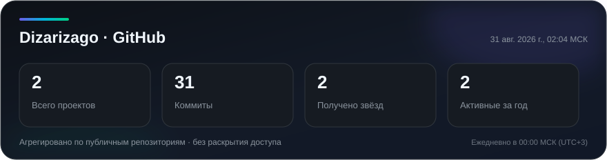
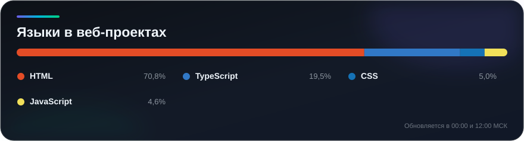

  

---

## 🧰 Технологический стек

  
  
  
  
  
  
  
  

## 📊 GitHub статистика

  

  

Карточки автоматически пересобираются ежедневно в 00:00 и 12:00 МСК. Отображаются только агрегированные показатели — без ссылок и доступа к проектам.

## 🎯 Обо мне

  
  
  

  Фронтенд-разработчик с фокусом на выразительные, интерактивные и производительные
  веб-приложения. Превращаю идеи в понятные интерфейсы и постоянно улучшаю качество
  пользовательского опыта.

## 📖 Изучаю сейчас

  
  
  
  

## 📬 Контакты

  
  
  
  

